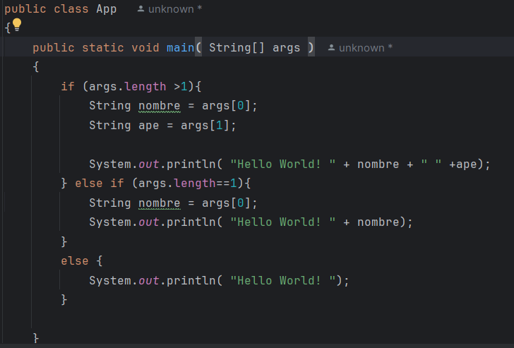
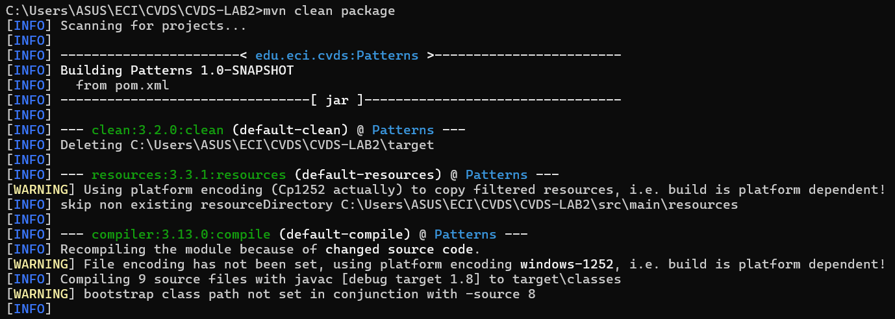
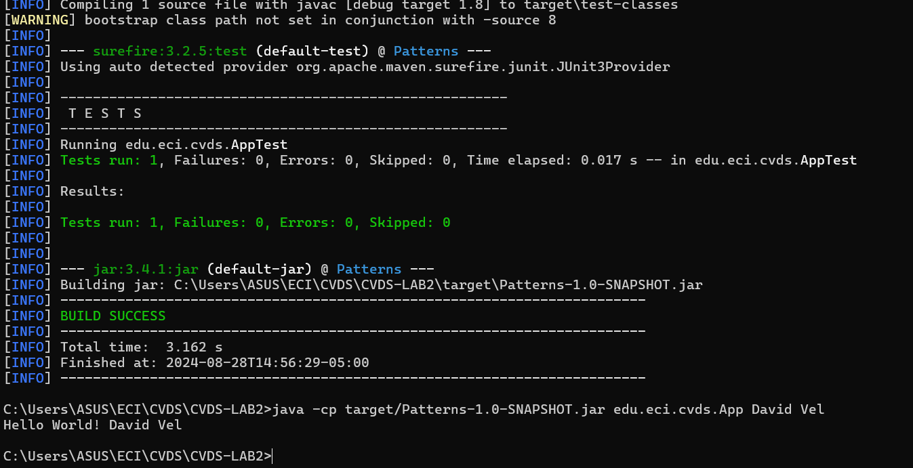
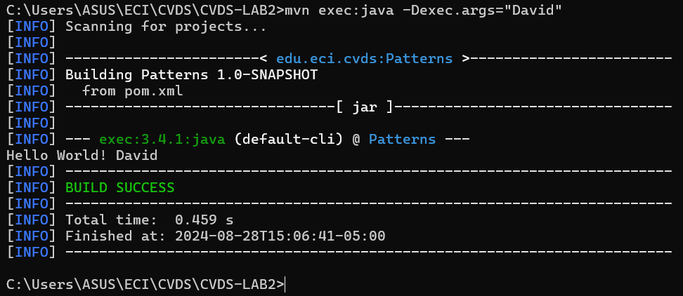
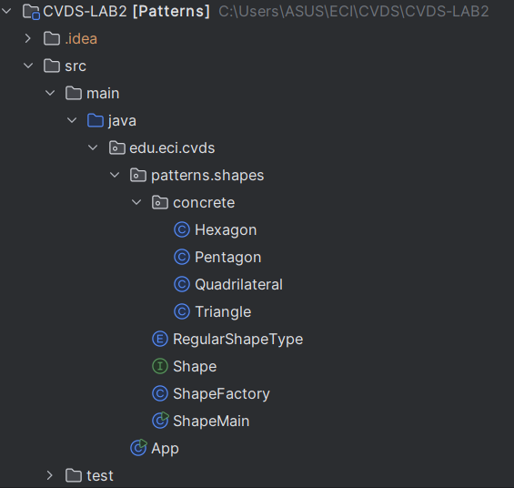
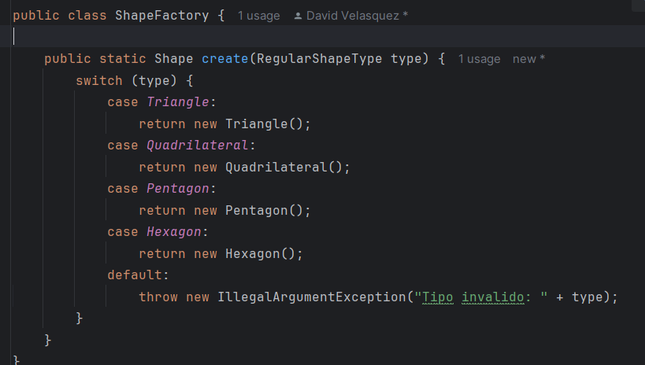
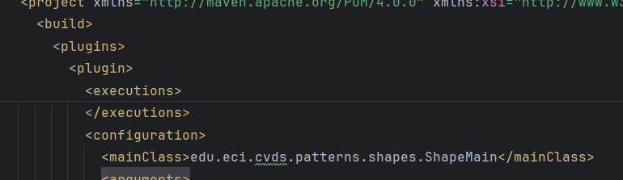
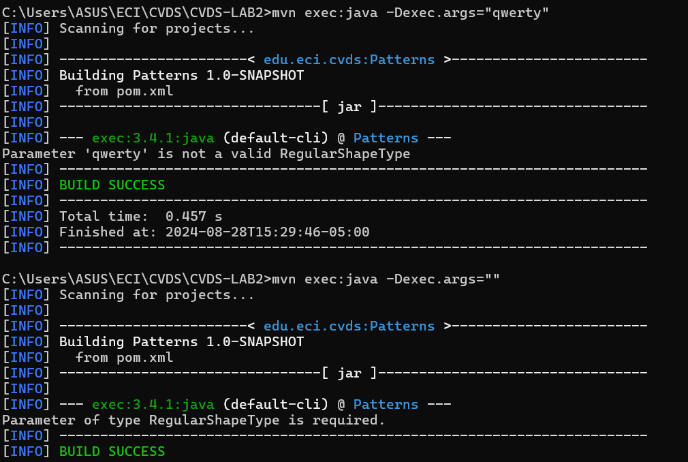
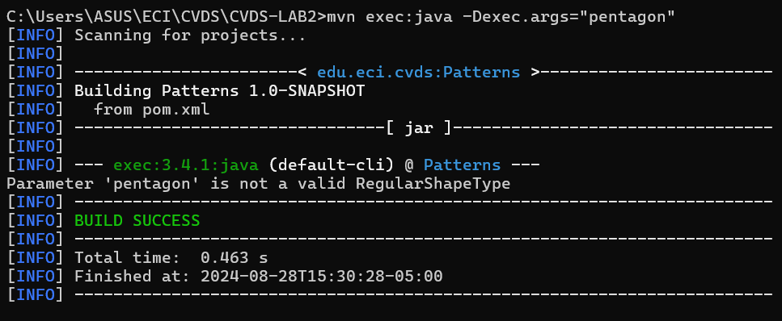
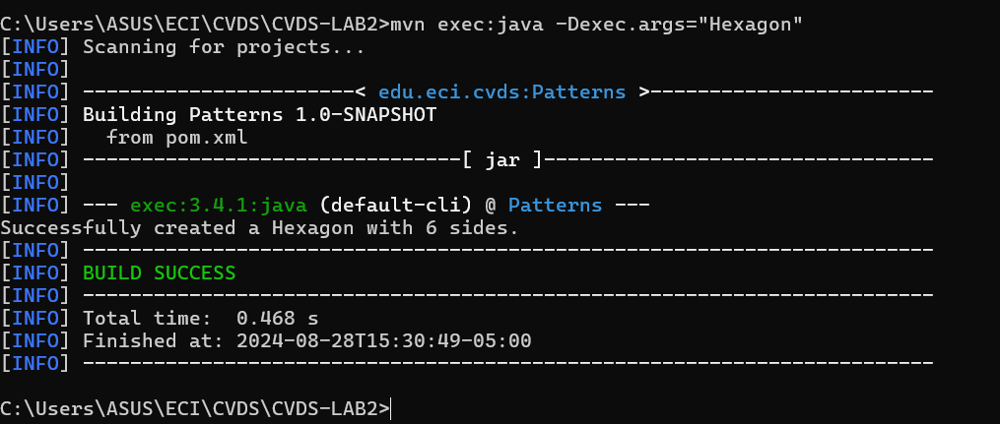

Integrantes:

Santiago Diaz
David Velasquez

Respuestas a preguntas:

- ¿Busque cuál es el objetivo del parámetro "package" y qué otros parámetros se podrían enviar al comando mvn?

- Rta: El objetivo del comando es compilar el codigo fuente y empaquetarlo en un formato JAR, este compila, luego ejecuta las pruebas unitarias luego empaqueta en un Jar. Otros comandos que sirven son clean que elmina los arhchivos generados en el directorio para una compilacion nueva, compile que lo que hace es compilar sin pruebas ni empaquetar, test para solo ejecutar las pruebas, install que empaqueta el proyecto lo instala en el repo local de maven y otros como deploy, validate, verify, site dependency:tree que muestra un arbol de la organizacio y demas.

- Buscar cómo enviar parámetros al plugin "exec".
- Rta: Se envian luego del comando de ejecucion mvn exec: java y luego se l e añade -Dnombre="Santiago" por ejemplo, esto funciona ya que configuramos correctamente el pom con el plugin de exec.
  
- Ejecutar la clase con su nombre y apellido como parámetro. ¿Qué sucedió?
- Rta: Lo que sucedio es que solo lee un parametro dada su configuracion que es unicamente para recibir un paramero, debemos poner el otro tambien en la carpeta de pom, ejecutandol asi ya funciono correctamente.

Ahora aqui vamos a ir documentando el procedimiento realizado, se perdieron las imagenes de la instalacion y el inicio pero ya que esa aqui podemos mostrar que ya una vez montado el proyecto editamos la clase main para realizar esto:

Luego compilamos con mvn clean package que limpia y empaqueta por decirlo asi, con esto podemos luego ejecutar como se ve aqui:

Tambien funciona con el comando exec como tal que es el que configuramos en el pom:

Funciona en todos los casos de prueba con 0, 1 o 2 atributos, ahora designamos los archivos que vamos a utilizar:

Como indica en el laboratorio debemos hacer una clase con el oatron "factory" el cual indica que debemos utilizar la interfaz para crear nuestras clases.

Ya hicimos el codigo, utilizando como parametro el enum podemos aplicar lo que debiamos hacer:

Ahora necesitamos cambiar la clase main en el archivo pom:

Con esto volvemos a hacer mvn clean package y ejecutamos con las pruebas de parametros a continuacion:

Gracias a esto verificamos que solamente el ultimo funciona, con esto pues verificamos que los casos obvios donde no deberia funcionar efectivamente no funciona ya que entra a la excepcion, sin embargo tambien es sensible a mayusculas y demas, por lo tanto el enum solo funciona bien cuando el tipo es exactamente igual al designado alli.
